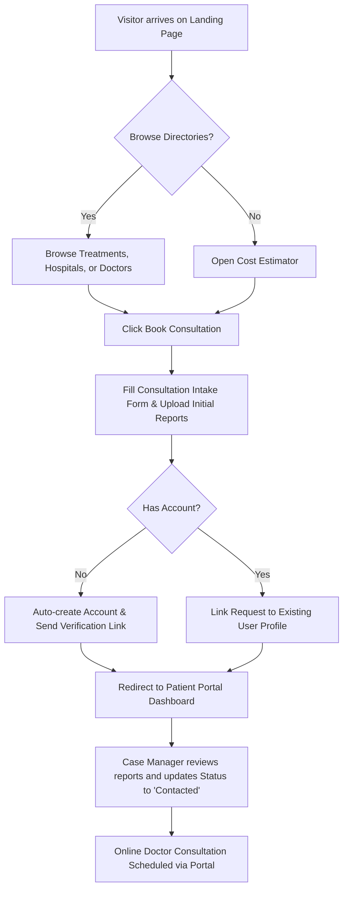
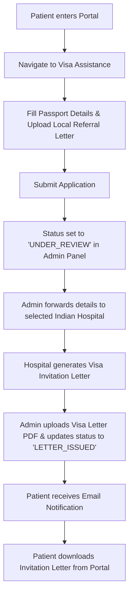
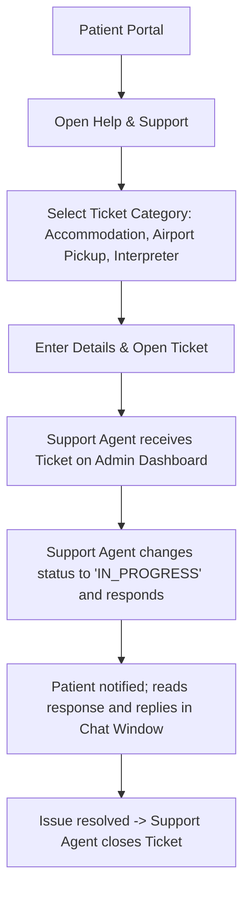
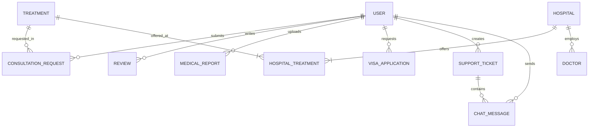

# MediBridge India 🏥 — Product Blueprint
**Comprehensive System Architecture, Design, and Requirements Specification**

---

## 1. Product Requirements Document (PRD)

### 1.1 Executive Summary
**MediBridge India** is a premier Medical Tourism Platform designed to connect international patients with world-class, affordable healthcare services in India. The platform streamlines the entire patient journey—from initial exploration and treatment cost estimation to secure medical report uploads, doctor consultations, medical visa assistance, and post-treatment support.

### 1.2 Target Audience
*   **International Patients:** Individuals looking for affordable, high-quality, or specialized medical treatments (e.g., Cardiology, Orthopedics, Oncology) not easily accessible or affordable in their home countries.
*   **Hospitals & Clinics:** Indian healthcare facilities seeking to list their medical capabilities, accreditations, and specialties to attract international client bases.
*   **Doctors & Specialists:** Medical practitioners who want to offer remote consultations and review complex medical reports.
*   **Platform Administrators / Case Managers:** India-based operations team members who coordinate travel, visa invitation letters, translation services, and hospital appointments.

### 1.3 Key Performance Indicators (KPIs)
*   **Lead-to-Consultation Rate:** Percentage of visitors who request a consultation.
*   **Inquiry Response Time:** Average time taken by an administrator to address a patient support ticket or visa request (target: < 4 hours).
*   **Visa Approval Rate:** Percentage of patients successfully receiving a medical visa using the platform's support documents.
*   **Document Upload Success:** Percentage of medical report uploads successfully completed without error or security warnings.
*   **Net Promoter Score (NPS):** Overall patient satisfaction rating post-treatment.

---

### 1.4 Detailed Feature Specifications

#### 1. Treatments Directory
*   **Overview:** A searchable, filterable directory of medical treatments categorized by medical specialty.
*   **Functional Specs:**
    *   Filter by categories (e.g., Cardiology, Orthopedics, Oncology, Neurology).
    *   Search by keywords (e.g., "Bypass", "Hip Replacement").
    *   Treatment detail pages showing description, estimated recovery time, common risks, average cost range, and recommended hospitals.

#### 2. Hospitals Directory
*   **Overview:** Profile pages for partner hospitals showcasing facility quality, ratings, and specialties.
*   **Functional Specs:**
    *   Filter by city, accreditation (e.g., JCI, NABH), and rating.
    *   Hospital detail page showing description, address, contact coordinates, photo gallery, available specialties, and list of affiliated doctors.
    *   Display of treatments offered and their localized costs.

#### 3. Doctors Directory
*   **Overview:** Profiles of accredited doctors to build trust and allow direct booking/consultation.
*   **Functional Specs:**
    *   Search by name, specialty, or affiliated hospital.
    *   Doctor profile details: education, experience, biography, success rates, spoken languages, and consultation fees.
    *   Interactive rating score based on verified patient reviews.

#### 4. Cost Estimator
*   **Overview:** A multi-currency calculator comparing treatment costs across multiple hospitals.
*   **Functional Specs:**
    *   Select treatment and select multiple hospitals to compare.
    *   Multi-currency conversion (INR, USD, EUR, GBP, AED) utilizing live or cached exchange rates.
    *   Itemized breakdown (surgical fee, room charges, stay duration estimation) and a clear CTA to book a consultation for that estimate.

#### 5. Consultation Booking
*   **Overview:** Direct intake form initiating the medical tourism process.
*   **Functional Specs:**
    *   Capture patient full name, email, phone (with country code), country of residence, and preferred city.
    *   Selection of treatment needed and text field for medical history summary.
    *   Option to upload relevant medical files directly from the intake form.

#### 6. Patient Portal
*   **Overview:** A secure dashboard for registered patients to manage their journey.
*   **Functional Specs:**
    *   Track the status of consultation requests (Pending, Contacted, Approved, Scheduled).
    *   View uploaded medical reports and download case summaries.
    *   Manage active medical visa applications.
    *   Secure message center to communicate with assigned case managers.

#### 7. Admin Dashboard
*   **Overview:** Operational panel for administrators and case managers.
*   **Functional Specs:**
    *   CRUD operations for Treatments, Hospitals, and Doctors.
    *   Manage Consultation Requests and transition status.
    *   Review and approve user-submitted Reviews/Testimonials.
    *   Approve and upload Visa Invitation Letters to patient profiles.
    *   Support ticket/inquiry resolution console.

#### 8. Medical Report Upload
*   **Overview:** Secure, HIPAA-compliant document vault.
*   **Functional Specs:**
    *   Supports PDF, JPEG, PNG, and DICOM (imaging) files.
    *   End-to-end encryption for stored documents.
    *   Automatic malware scan on file upload.

#### 9. International Patient Support
*   **Overview:** Dedicated support system assisting with logistic hurdles.
*   **Functional Specs:**
    *   Support ticketing system separated by category (Travel, Accommodation, Language Interpreter, Billing).
    *   Interactive chat interface between Patient and assigned Support Agent.

#### 10. Medical Visa Assistance
*   **Overview:** Streamlined visa invitation workflow.
*   **Functional Specs:**
    *   Form for passport details (number, expiry, nationality) and doctor's prescription upload.
    *   Generation of a Visa Invitation Letter request sent directly to the selected Indian hospital.
    *   Status tracking for the visa invitation letter (Under Review -> Letter Issued -> Download Ready).

---

## 2. User Roles & Permissions

| Feature / Action | Guest (Visitor) | Patient (Auth User) | Support Agent | Admin |
| :--- | :---: | :---: | :---: | :---: |
| Browse Directories & Costs | ✅ | ✅ | ✅ | ✅ |
| Run Cost Calculator | ✅ | ✅ | ✅ | ✅ |
| Register Account | ✅ | ❌ | ❌ | ❌ |
| Submit Consultation Request | ✅ | ✅ | ✅ | ✅ |
| Upload Medical Reports | ❌ | ✅ | ✅ | ✅ |
| Apply for Medical Visa | ❌ | ✅ | ✅ | ✅ |
| View Patient Portal Dashboard | ❌ | ✅ | ✅ (assigned cases) | ✅ |
| Manage Support Tickets | ❌ | ✅ (own tickets) | ✅ | ✅ |
| Access Admin Panel | ❌ | ❌ | ❌ | ✅ |
| CRUD Hospitals/Doctors/Treatments | ❌ | ❌ | ❌ | ✅ |
| Approve Reviews & Testimonials | ❌ | ❌ | ❌ | ✅ |

---

## 3. User Flows

### 3.1 Patient Consultation & Booking Flow
This flow details how a new patient goes from discovering a treatment to booking a consultation, uploading reports, and tracking their status.



### 3.2 Medical Visa Assistance Flow
This flow documents how a patient applies for visa assistance and how the admin uploads the hospital invitation letter.



### 3.3 Interactive Support Flow
This flow models the real-time or ticket-based communication between the patient and international support team.



---

## 4. Information Architecture (IA)

### 4.1 Site Navigation Tree
```
MediBridge India / (Home Page)
│
├── 📂 public/ (Guest Accessible)
│   ├── 📄 Treatments Directory (/treatments)
│   │   └── 📄 Treatment Detail (/treatments/[id])
│   ├── 📄 Hospitals Directory (/hospitals)
│   │   └── 📄 Hospital Detail (/hospitals/[id])
│   ├── 📄 Doctors Directory (/doctors)
│   │   └── 📄 Doctor Detail (/doctors/[id])
│   ├── 📄 Cost Estimator (/cost-estimator)
│   ├── 📄 Book Consultation Intake (/consultation)
│   └── 📂 auth/
│       ├── 📄 Login (/auth/login)
│       ├── 📄 Sign Up (/auth/signup)
│       └── 📄 Forgot Password (/auth/forgot-password)
│
├── 📂 portal/ (Authenticated Patients)
│   ├── 📄 Dashboard Overview (/portal)
│   ├── 📄 Medical Reports (/portal/reports)
│   ├── 📄 Visa Applications (/portal/visa)
│   ├── 📄 Support Center & Tickets (/portal/support)
│   └── 📄 User Settings (/portal/settings)
│
└── 📂 admin/ (Admin & Support Staff)
    ├── 📄 Admin Dashboard Overview (/admin)
    ├── 📄 Manage Consultations (/admin/consultations)
    ├── 📄 Manage Visa Requests (/admin/visa)
    ├── 📄 Manage Support Tickets (/admin/support)
    ├── 📄 Manage Directory Data (/admin/directory)
    └── 📄 Review Approvals (/admin/reviews)
```

---

## 5. Database Schema

### 5.1 Prisma Schema Specification (Next-Gen Extensions)
Below is the proposed, production-ready schema including the existing database schema plus the structural upgrades for Support, Tickets, and Visa Status workflows:

```prisma
datasource db {
  provider = "postgresql"
  url      = env("DATABASE_URL")
}

generator client {
  provider = "prisma-client-js"
}

enum Role {
  USER
  ADMIN
  SUPPORT_AGENT
}

enum RequestStatus {
  PENDING
  CONTACTED
  APPROVED
  REJECTED
}

enum VisaStatus {
  PENDING
  UNDER_REVIEW
  LETTER_ISSUED
  APPROVED
  REJECTED
}

enum TicketCategory {
  TRAVEL
  ACCOMMODATION
  BILLING
  MEDICAL
  GENERAL
}

enum TicketPriority {
  LOW
  MEDIUM
  HIGH
  URGENT
}

enum TicketStatus {
  OPEN
  IN_PROGRESS
  RESOLVED
  CLOSED
}

model User {
  id        String   @id @default(cuid())
  name      String
  email     String   @unique
  password  String
  role      Role     @default(USER)
  createdAt DateTime @default(now())
  updatedAt DateTime @updatedAt

  consultationRequests ConsultationRequest[]
  reviews              Review[]
  medicalReports       MedicalReport[]
  visaApplications     VisaApplication[]
  supportTickets       SupportTicket[]
  messages             ChatMessage[]
}

model Treatment {
  id             String   @id @default(cuid())
  name           String
  category       String
  description    String   @db.Text
  estimatedCost  Float
  recoveryTime   String
  risks          String   @db.Text
  image          String   @default("")
  createdAt      DateTime @default(now())
  updatedAt      DateTime @updatedAt

  consultationRequests ConsultationRequest[]
  hospitals            HospitalTreatment[]
}

model Hospital {
  id                 String   @id @default(cuid())
  name               String
  city               String
  accreditation      String
  rating             Float    @default(0)
  description        String   @db.Text
  image              String   @default("")
  specialties        String   @db.Text
  gallery            String   @db.Text @default("[]")
  contactEmail       String   @default("")
  contactPhone       String   @default("")
  address            String   @default("")
  createdAt          DateTime @default(now())
  updatedAt          DateTime @updatedAt

  doctors            Doctor[]
  treatments         HospitalTreatment[]
}

model Doctor {
  id              String   @id @default(cuid())
  name            String
  specialty       String
  experience      Int
  rating          Float    @default(0)
  languages       String   @default("")
  consultationFee Float    @default(0)
  education       String   @db.Text
  biography       String   @db.Text
  certifications  String   @db.Text
  successRate     Float    @default(0)
  image           String   @default("")
  hospitalId      String
  createdAt       DateTime @default(now())
  updatedAt       DateTime @updatedAt

  hospital        Hospital @relation(fields: [hospitalId], references: [id])
}

model HospitalTreatment {
  hospitalId  String
  treatmentId String
  cost        Float

  hospital  Hospital  @relation(fields: [hospitalId], references: [id])
  treatment Treatment @relation(fields: [treatmentId], references: [id])

  @@id([hospitalId, treatmentId])
}

model ConsultationRequest {
  id              String        @id @default(cuid())
  fullName        String
  email           String
  phone           String
  country         String
  treatmentNeeded String
  medicalHistory  String        @db.Text @default("")
  preferredCity   String        @default("")
  status          RequestStatus @default(PENDING)
  userId          String?
  treatmentId     String?
  createdAt       DateTime      @default(now())
  updatedAt       DateTime      @updatedAt

  user            User?         @relation(fields: [userId], references: [id])
  treatment       Treatment?    @relation(fields: [treatmentId], references: [id])
}

model Review {
  id        String   @id @default(cuid())
  rating    Int
  comment   String   @db.Text
  approved  Boolean  @default(false)
  userId    String
  createdAt DateTime @default(now())
  updatedAt DateTime @updatedAt

  user      User     @relation(fields: [userId], references: [id])
}

model MedicalReport {
  id          String   @id @default(cuid())
  userId      String
  fileUrl     String
  fileName    String
  description String?  @db.Text
  createdAt   DateTime @default(now())
  updatedAt   DateTime @updatedAt

  user        User     @relation(fields: [userId], references: [id])
}

model VisaApplication {
  id              String     @id @default(cuid())
  userId          String
  passportNumber  String
  country         String
  status          VisaStatus @default(PENDING)
  documentUrl     String?    // User's passport or local medical records
  invitationUrl   String?    // Issued Invitation letter uploaded by admin
  createdAt       DateTime   @default(now())
  updatedAt       DateTime   @updatedAt

  user            User       @relation(fields: [userId], references: [id])
}

model SupportTicket {
  id          String         @id @default(cuid())
  userId      String
  subject     String
  description String         @db.Text
  category    TicketCategory @default(GENERAL)
  priority    TicketPriority @default(LOW)
  status      TicketStatus   @default(OPEN)
  createdAt   DateTime       @default(now())
  updatedAt   DateTime       @updatedAt

  user        User           @relation(fields: [userId], references: [id])
  messages    ChatMessage[]
}

model ChatMessage {
  id        String   @id @default(cuid())
  ticketId  String
  senderId  String
  message   String   @db.Text
  fileUrl   String?
  createdAt DateTime @default(now())

  ticket    SupportTicket @relation(fields: [ticketId], references: [id], onDelete: Cascade)
  sender    User          @relation(fields: [senderId], references: [id])
}
```

### 5.2 Entity-Relationship (ER) Diagram
This diagram outlines relations and cardinality between our key entities.



---

## 6. API Architecture

### 6.1 Authentication Services
*   **POST** `/api/auth/register` — Creates a new patient account.
*   **POST** `/api/auth/login` — Verifies credentials, signs JWT, and issues it via HTTP-only Cookie.
*   **POST** `/api/auth/logout` — Revokes/clears authentication cookie.
*   **GET** `/api/auth/me` — Returns current logged-in user details.

### 6.2 Directory Routes
*   **GET** `/api/treatments` — Fetches treatments. Query parameters: `?category=x&search=y`.
*   **GET** `/api/treatments/[id]` — Detailed treatment description.
*   **GET** `/api/hospitals` — Fetch hospitals listing. Filterable by: `?city=x&rating=y&accreditation=z`.
*   **GET** `/api/hospitals/[id]` — Detailed profile with affiliated doctors and specialties list.
*   **GET** `/api/doctors` — List doctors matching specialty or hospital.
*   **GET** `/api/doctors/[id]` — Full doctor CV, fee, and success rate details.

### 6.3 Cost Estimator API
*   **GET** `/api/estimator` — Returns computed itemized costs.
    *   *Query Parameters:* `?treatmentId=id&hospitalIds=id1,id2&currency=USD`
    *   *Response Payload:*
        ```json
        {
          "treatment": "Knee Replacement",
          "currency": "USD",
          "comparison": [
            {
              "hospitalId": "hosp-1",
              "hospitalName": "Apollo Hospitals, Chennai",
              "estimatedCost": 5400.00,
              "breakdown": {
                "surgicalFee": 3200.00,
                "roomRentPerDay": 250.00,
                "hospitalStayDays": 6,
                "implantsAndMedication": 700.00
              }
            }
          ]
        }
        ```

### 6.4 Consultation Bookings
*   **POST** `/api/consultations` — Creates a consultation request. Securely links to an account if auth is detected.
*   **GET** `/api/consultations` — Retrieves logged-in user's consultation history (or all requests for Admin).

### 6.5 Medical Reports Vault
*   **POST** `/api/reports` — Requests pre-signed upload URL for files (PDF, DICOM, Images) targeting Amazon S3 or Vercel Blob. Saves file metadata to PostgreSQL.
*   **GET** `/api/reports` — Lists user's medical documents.
*   **DELETE** `/api/reports/[id]` — Removes file metadata from DB and triggers soft or hard delete in cloud storage.

### 6.6 Visa Applications & Assistance
*   **POST** `/api/visa` — Submit passport data and request invitation letter from selected hospital.
*   **GET** `/api/visa` — Read current application statuses.
*   **PUT** `/api/visa/[id]/status` — (Admin only) Updates VisaStatus and uploads issued `invitationUrl`.

### 6.7 Support & Interactive Ticketing
*   **POST** `/api/support/tickets` — Open support case.
*   **GET** `/api/support/tickets` — View all own tickets (or all open cases for support staff).
*   **POST** `/api/support/tickets/[id]/messages` — Add text or file message to ticket chat logs.
*   **GET** `/api/support/tickets/[id]/messages` — Returns full chronological message list for the ticket.

---

## 7. Technical Architecture

### 7.1 Infrastructure Topology
```
[ Web Browser Client ] (React 19 / Tailwind / Framer Motion)
       │
       ▼ (HTTPS / HTTP-only JWT Cookie)
[ Next.js 16 Edge / Node Server ] (App Router Routing & API endpoints)
       │
       ├──────► [ PostgreSQL Database ] (via Prisma ORM - Hosted on Neon DB / RDS)
       │
       ├──────► [ File Upload S3 Bucket ] (Secure storage for reports / visas)
       │
       ├──────► [ ExchangeRate API ] (Third-party fetch for estimator conversions)
       │
       └──────► [ Transactional Email API ] (Resend / SendGrid for notifications)
```

### 7.2 Core Stack Selections
*   **Framework:** Next.js 16 (App Router) with React 19. Offers Server Components for excellent SEO and client-side rendering for interactive estimators/portals.
*   **Database:** PostgreSQL. Offers robust relational models, transactional stability, and full text search support for doctor/treatment directories.
*   **ORM:** Prisma. Generates fully type-safe database queries.
*   **State Management:** Zustand (for lightweight local client state like auth cookies) + TanStack React Query (for server data synchronization).
*   **File Storage:** AWS S3 or Vercel Blob (Private mode) to hold encrypted medical files.
*   **Security Scanning:** Integrated ClamAV or VirusTotal API checking uploaded reports.

### 7.3 Security & Regulatory Guidelines (HIPAA / GDPR Compliance)
*   **Data Isolation:** Medical reports are stored in an S3 Bucket with blocked public access. Download links are short-lived pre-signed URLs (e.g., expires in 15 minutes).
*   **Encryption at Rest:** PostgreSQL database is encrypted using AWS KMS keys. Storage volumes containing logs are fully encrypted.
*   **Encryption in Transit:** All traffic is strictly restricted to HTTPS with TLS 1.3.
*   **User Session Control:** JWTs are stored in `HttpOnly` and `SameSite=Strict` cookies, preventing cross-site scripting (XSS) extraction.
*   **Audit Logging:** Database changes (specifically on Patient Reports and Visa applications) record `userId`, `action`, and `timestamp` fields into an immutable audit table.

### 7.4 Deployment & Hosting
*   **Application Deployment:** Hosted on **Vercel** or AWS Amplify for optimal Next.js serverless performance and edge routing.
*   **Database Hosting:** **Neon Database** (Serverless PostgreSQL) or AWS RDS (Multi-AZ configuration for high availability and automated snapshots).
*   **Static Asset Storage:** Content Delivery Network (CDN) via Cloudflare or Vercel Edge Cache to distribute landing images, scripts, and stylesheets instantly.

---
*End of Blueprint Document. Ready for User Review.*
