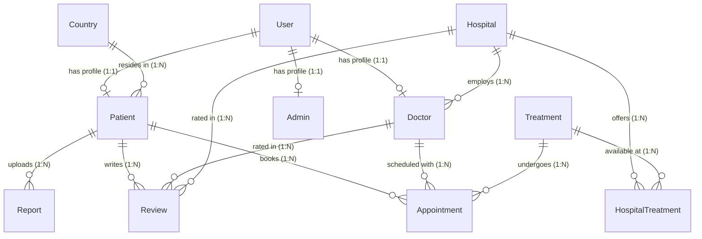

# MediBridge India 🏥 — Database Schema Blueprint
**Production-Grade Relational Schema, Constraints, Indexes, and Prisma Modeling**

This document specifies the database architecture for the MediBridge India Medical Tourism Platform. It details the PostgreSQL database tables, relationships, integrity constraints, indexing strategies, and provides the production Prisma schema.

---

## 1. Database Entity-Relationship Map

The schema utilizes a strict relational design centered around a unified `User` table for authentication, which links via 1-to-1 relationships to role-specific profiles (`Patient`, `Doctor`, `Admin`). This prevents data duplication and keeps authentication scopes clean.



---

## 2. PostgreSQL DDL Specification (Production Elements)

This section highlights the production-grade PostgreSQL definitions, detailing database integrity rules, check constraints, and custom indexes.

### 2.1 Enums & Types
```sql
CREATE TYPE "Role" AS ENUM ('ADMIN', 'PATIENT', 'DOCTOR', 'STAFF');
CREATE TYPE "AppointmentStatus" AS ENUM ('PENDING', 'CONFIRMED', 'COMPLETED', 'CANCELLED');
CREATE TYPE "VisaStatus" AS ENUM ('PENDING', 'UNDER_REVIEW', 'LETTER_ISSUED', 'APPROVED', 'REJECTED');
```

### 2.2 Relational Integrity & Integrity Constraints
*   **Unique Constraints:**
    *   `Users(email)`: Ensures no duplicate accounts.
    *   `Patients(userId)` and `Doctors(userId)`: Enforces strict 1-to-1 identity rules.
    *   `Countries(code)` and `Countries(name)`: Prevent duplicate configuration records.
*   **Check Constraints (Postgres Native):**
    *   `Reviews(rating)`: Enforces `CHECK (rating >= 1 AND rating <= 5)`.
    *   `Doctors(rating)`: Enforces `CHECK (rating >= 0.0 AND rating <= 5.0)`.
    *   `Doctors(successRate)`: Enforces `CHECK (successRate >= 0.0 AND successRate <= 100.0)`.
    *   `Hospitals(rating)`: Enforces `CHECK (rating >= 0.0 AND rating <= 5.0)`.
    *   `HospitalTreatments(averageCost)`: Enforces `CHECK (averageCost >= 0.0)`.
    *   `Reports(fileSize)`: Enforces `CHECK (fileSize > 0)`.
*   **Referential Actions:**
    *   When a `User` is deleted, cascade deleting profile rows (`ON DELETE CASCADE` for `Patient`, `Doctor`, `Admin`).
    *   When a `Treatment` or `Hospital` is deleted, restrict deletion if there are active bookings (`ON DELETE RESTRICT` for `Appointment`).

### 2.3 Indexing Optimization Strategies
*   **Primary Keys:** Automatic indexes are generated for all Primary Keys (`id` fields).
*   **Foreign Key Indexes:** Explicit indexes are added on all relation joining columns to prevent slow full-table scans during dashboard and profile fetches:
    *   `idx_patient_userId` (Patient profile resolves)
    *   `idx_doctor_userId` (Doctor profile resolves)
    *   `idx_doctor_hospitalId` (Hospital details page listing doctors)
    *   `idx_appointment_patientId`, `idx_appointment_doctorId` (Portal timelines and calendar lookups)
    *   `idx_report_patientId` (Medical report dashboard downloads)
    *   `idx_review_hospitalId`, `idx_review_doctorId` (Listing approved reviews on profile pages)
*   **Covering / Composite Indexes:**
    *   `idx_hospital_treatment_composite` on `HospitalTreatment(hospitalId, treatmentId)`: Accelerates cost comparisons.
*   **Full-Text Search Indexing:**
    *   GiST / GIN indexes on `Hospitals(name, city)` and `Doctors(fullName, specialty)` to support high-performance matching search fields.

---

## 3. Prisma Production Schema (`schema.prisma`)

Below is the ready-to-run Prisma schema implementing the architecture.

```prisma
datasource db {
  provider = "postgresql"
  url      = env("DATABASE_URL")
}

generator client {
  provider = "prisma-client-js"
}

enum Role {
  ADMIN
  PATIENT
  DOCTOR
  STAFF
}

enum AppointmentStatus {
  PENDING
  CONFIRMED
  COMPLETED
  CANCELLED
}

enum VisaStatus {
  PENDING
  UNDER_REVIEW
  LETTER_ISSUED
  APPROVED
  REJECTED
}

model User {
  id           String   @id @default(cuid())
  email        String   @unique
  passwordHash String
  role         Role     @default(PATIENT)
  isActive     Boolean  @default(true)
  createdAt    DateTime @default(now())
  updatedAt    DateTime @updatedAt

  // 1:1 Profile Relations
  patientProfile Patient?
  doctorProfile  Doctor?
  adminProfile   Admin?
}

model Country {
  id           String    @id @default(cuid())
  name         String    @unique
  code         String    @unique // ISO 2-letter country code (e.g. "US", "GB")
  phoneCode    String    // Phone code (e.g. "+1", "+44")
  currency     String    @default("USD")
  requiresVisa Boolean   @default(true)
  isActive     Boolean   @default(true)
  createdAt    DateTime  @default(now())

  patients     Patient[]
}

model Patient {
  id                  String   @id @default(cuid())
  userId              String   @unique
  fullName            String
  phoneNumber         String
  passportNumber      String?  @unique
  preferredCity       String?
  medicalHistorySummary String?  @db.Text
  createdAt           DateTime @default(now())
  updatedAt           DateTime @updatedAt

  // Relationships
  user               User              @relation(fields: [userId], references: [id], onDelete: Cascade)
  countryId          String
  country            Country           @relation(fields: [countryId], references: [id])
  appointments       Appointment[]
  reports            Report[]
  reviews            Review[]
  visaApplications   VisaApplication[]

  @@index([userId])
  @@index([countryId])
}

model Hospital {
  id            String   @id @default(cuid())
  name          String
  city          String
  accreditation String   // JCI, NABH, etc.
  rating        Float    @default(0.0)
  description   String   @db.Text
  image         String?
  address       String
  gallery       String   @db.Text @default("[]") // JSON string of photo urls
  contactEmail  String
  contactPhone  String
  createdAt     DateTime @default(now())
  updatedAt     DateTime @updatedAt

  // Relationships
  doctors       Doctor[]
  treatments    HospitalTreatment[]
  reviews       Review[]

  @@index([city])
  @@index([rating])
}

model Doctor {
  id              String   @id @default(cuid())
  userId          String   @unique
  fullName        String
  specialty       String
  experienceYears Int
  rating          Float    @default(0.0)
  languages       String   // Comma separated values (e.g. "English, Arabic")
  consultationFee Decimal  @db.Decimal(10, 2)
  education       String   @db.Text
  biography       String   @db.Text
  certifications  String   @db.Text
  successRate     Float    @default(0.0)
  image           String?
  createdAt       DateTime @default(now())
  updatedAt       DateTime @updatedAt

  // Relationships
  user            User          @relation(fields: [userId], references: [id], onDelete: Cascade)
  hospitalId      String
  hospital        Hospital      @relation(fields: [hospitalId], references: [id])
  appointments    Appointment[]
  reviews         Review[]

  @@index([userId])
  @@index([hospitalId])
  @@index([specialty])
}

model Treatment {
  id            String   @id @default(cuid())
  name          String   @unique
  category      String   // Cardiology, Orthopedics, Oncology, etc.
  description   String   @db.Text
  recoveryTime  String   // e.g. "2-3 weeks"
  risks         String   @db.Text
  createdAt     DateTime @default(now())
  updatedAt     DateTime @updatedAt

  // Relationships
  hospitals     HospitalTreatment[]
  appointments  Appointment[]

  @@index([category])
}

model HospitalTreatment {
  hospitalId  String
  treatmentId String
  averageCost Decimal @db.Decimal(10, 2)

  // Relationships
  hospital  Hospital  @relation(fields: [hospitalId], references: [id], onDelete: Cascade)
  treatment Treatment @relation(fields: [treatmentId], references: [id], onDelete: Cascade)

  @@id([hospitalId, treatmentId])
  @@index([hospitalId])
  @@index([treatmentId])
}

model Appointment {
  id              String            @id @default(cuid())
  patientId       String
  doctorId        String
  treatmentId     String
  appointmentDate DateTime
  status          AppointmentStatus @default(PENDING)
  consultationFee Decimal           @db.Decimal(10, 2)
  notes           String?           @db.Text
  createdAt       DateTime          @default(now())
  updatedAt       DateTime      @updatedAt

  // Relationships
  patient   Patient   @relation(fields: [patientId], references: [id], onDelete: Restrict)
  doctor    Doctor    @relation(fields: [doctorId], references: [id], onDelete: Restrict)
  treatment Treatment @relation(fields: [treatmentId], references: [id], onDelete: Restrict)

  @@index([patientId])
  @@index([doctorId])
  @@index([treatmentId])
  @@index([appointmentDate])
}

model Report {
  id          String   @id @default(cuid())
  patientId   String
  fileUrl     String
  fileName    String
  fileType    String   // PDF, DICOM, JPEG, etc.
  fileSize    Int      // in Bytes
  description String?  @db.Text
  uploadedAt  DateTime @default(now())
  updatedAt   DateTime @updatedAt

  // Relationships
  patient     Patient  @relation(fields: [patientId], references: [id], onDelete: Cascade)

  @@index([patientId])
}

model Review {
  id         String   @id @default(cuid())
  patientId  String
  doctorId   String?
  hospitalId String?
  rating     Int      // Constrained to 1-5 in business logic
  comment    String   @db.Text
  isApproved Boolean  @default(false)
  createdAt  DateTime @default(now())
  updatedAt  DateTime @updatedAt

  // Relationships
  patient  Patient   @relation(fields: [patientId], references: [id], onDelete: Cascade)
  doctor   Doctor?   @relation(fields: [doctorId], references: [id], onDelete: SetNull)
  hospital Hospital? @relation(fields: [hospitalId], references: [id], onDelete: SetNull)

  @@index([patientId])
  @@index([doctorId])
  @@index([hospitalId])
}

model VisaApplication {
  id            String     @id @default(cuid())
  patientId     String
  passportNum   String
  countryOfVisa String
  status        VisaStatus @default(PENDING)
  documentUrl   String?
  invitationUrl String?
  createdAt     DateTime   @default(now())
  updatedAt     DateTime   @updatedAt

  // Relationships
  patient       Patient    @relation(fields: [patientId], references: [id], onDelete: Cascade)

  @@index([patientId])
}

model Admin {
  id         String   @id @default(cuid())
  userId     String   @unique
  fullName   String
  department String   // e.g. "Visa Coordination", "Billing Support", "Core Admin"
  createdAt  DateTime @default(now())
  updatedAt  DateTime @updatedAt

  // Relationships
  user       User     @relation(fields: [userId], references: [id], onDelete: Cascade)

  @@index([userId])
}
```

---
*End of Schema Blueprint.*
